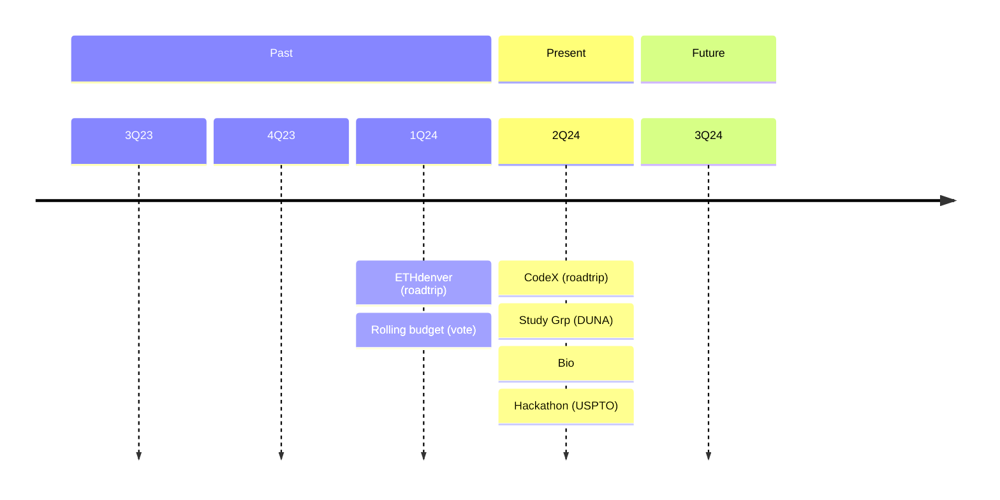

---

title: Lex Automata Pro Publica
dscription: Sponsorship of outreach activities (reverse chronological)

---

# Lex Automata Pro Publica

Founding member of [DAO Coalition](https://www.daocoalition.org/member-daos) which has [501(c)4](https://www.irs.gov/charities-non-profits/other-non-profits/social-welfare-organizations) status

## Public Events 2024 window (+/- 2Q)
> [!WARNING]
> incomplete data
 

## Hosted Events

| Event | Vote | Date | Notes |
|-------|------|------|-------|
| Hackathon | /tba/ | May 2024 | |
| Study Group |        | Apr 2024 | DUNA [Video](https://youtu.be/HUt8N4eMBE8?feature=shared) |
| Study Group | 100% | Sep 2022 | Videos | [100https://snapshot.org/#/lexdao.eth/proposal/0x2d185c5c07a4b1a8e6578b3434189772f6f809030a095f533c16b0ab1e790aa7) | 

## Sponsorship

Latest 26-28 Apr Bio-Cyber Summit
 

| Event | Vote | 
|-------|------|
| [Institutional Ecologies](https://conferences.law.stanford.edu/futurelaw2024/institutional-ecologies-recognizing-restoring-and-relating-with-nature/) |    |
| ETHdenver 2022 | [100%](https://snapshot.org/#/lexdao.eth) |

## Outreach

<!-- @bestape ... you've got the roadtrip -->
| RoadWarrior | Vote | Date | Amount| Evidence |
|-------------|------|------|-------|----------|
| en espanol    |        |    |    | [LatAm](https://hackmd.io/@lex-dao/By0-VLmZA)   |
| ETHdenber    |    |    | | [videos /tbd/ ](https://www.youtube.com/@LexDAO)   | 
| @bestape | 100% | ??? | :dollar: 3,500 |[report](https://hackmd.io/In0MC4DFTny05H0dALCaZA) |

## Periodicals

- :crossed_swords:LexNews+:scales: (weekly)
- :hammer_and_pick:Journal of Legal Engineering:spider_web: (biannual) _forthcoming_ 4Q2024 
- ſΞ©️ Legal Engineering ~~G~~HitBook (BUIDL and HODL edition) concept - design and anti-fragile case studies 2025+
